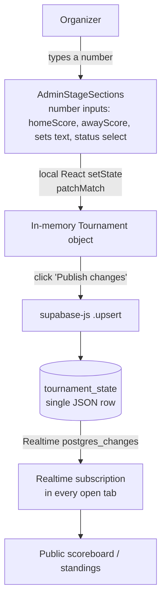
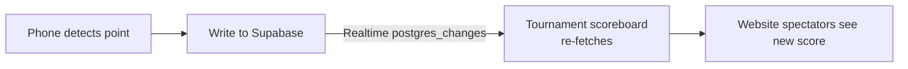
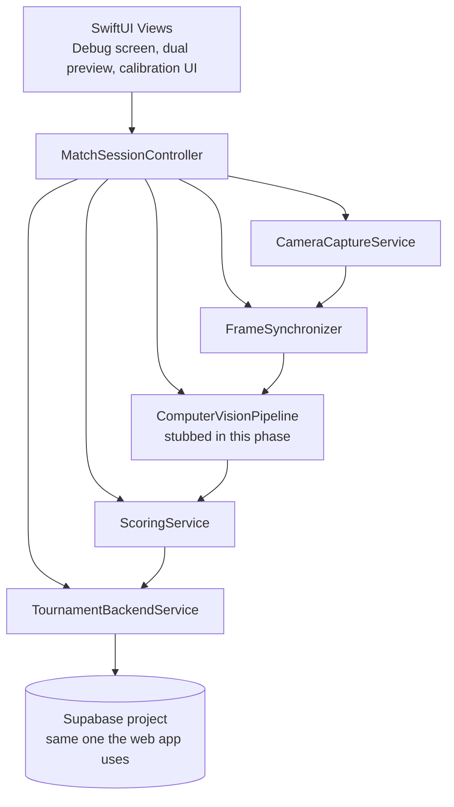
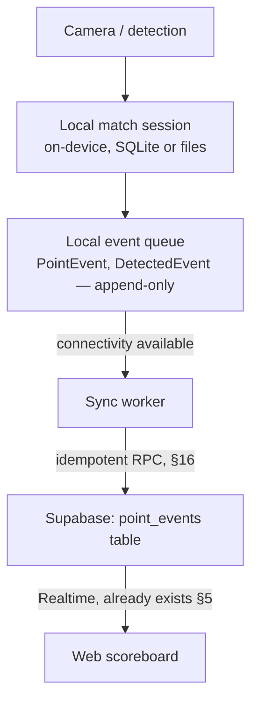

# Padel Camera Tracking — Milestone 1: Repository Inspection & Architecture

Status: proposal only. No application code, schema, or camera implementation was changed as part of this milestone.

Repository inspected: `AhmedAtefAli/padel-tournament-manager` (cloned at inspection time from `main`, no separate branches inspected).

---

## 1. Current repository architecture

This is **not** a client/server monorepo. It is a single Vite + React static site with **no backend of its own** — the backend is entirely Supabase (hosted Postgres + Auth + Realtime + Edge Functions), accessed directly from the browser with the anon/publishable key. There is no Express/Fastify/Next API layer, no custom REST server, and no mobile app.

```text
padel-tournament-manager/
  src/
    App.tsx                 # routes to admin vs public bundle based on ?admin=1 / #/admin
    admin/
      AdminApp.tsx           # organizer auth, tournament editing, organizer approval
      AdminStageSections.tsx # per-stage match score editing UI
      access.ts              # pure function deciding organizer authorization state
    public/
      PublicApp.tsx           # spectator shell (main view / standings view)
      LiveMatches.tsx          # "live now" cards
      PublicStageSections.tsx  # matches grouped by stage
      standings/
        standings.ts           # pure standings + team-journey calculations
        PublicStandings.tsx
    shared/
      tournament.ts    # Tournament/Team/Match TypeScript types + seed data
      supabase.ts      # Supabase client singleton
      useTournament.ts # read + realtime-subscribe hook
  supabase/
    schema.sql                  # full DB schema, RLS policies, RPC functions
    functions/
      notify-owner/index.ts      # Edge Function: emails owner on organizer signup
      notify-applicant/index.ts  # Edge Function: emails organizer on approval
  test/                # node:test unit tests for pure logic only
  .github/workflows/pages.yml   # build + deploy to GitHub Pages (prod + PR previews)
```

Component inventory against the checklist:

| Component | Present? | Where |
|---|---|---|
| Frontend application | Yes | `src/` (React 19 + TypeScript + Vite), split into `admin` and `public` bundles |
| Backend application | No custom server | Supabase project (managed Postgres/Auth/Realtime/Functions) |
| Database layer | Yes | Supabase Postgres, schema in `supabase/schema.sql` |
| API layer | No REST/GraphQL server | PostgREST auto-generated by Supabase + 2 Edge Functions, called via `supabase-js` |
| Authentication | Yes | Supabase Auth (email/password) |
| Tournament management | Yes | `AdminApp.tsx` |
| Match management | Yes | `AdminStageSections.tsx` (add/edit/remove matches) |
| Player management | Minimal | Players are a free-text string on `Team` (`"Omar & Karim"`), not a separate entity |
| Scoring logic | Manual only | Organizer types final numbers into `AdminStageSections.tsx`; no scoring engine |
| Real-time communication | Yes | Supabase Realtime `postgres_changes` on `tournament_state` |
| Deployment configuration | Yes | `.github/workflows/pages.yml` → GitHub Pages, static hosting only |
| Shared models/types | Yes | `src/shared/tournament.ts` |
| Tests | Yes, narrow | `test/*.test.ts`, pure-function unit tests only, no integration/e2e |
| Mobile applications | **None** | No iOS/Android/Flutter/React Native anywhere in the repo |

---

## 2. Current technology stack

**Frontend** — evidence in `package.json`, `vite.config.ts`, `src/App.tsx`:
- Framework: React 19.2, code-split with `React.lazy`/`Suspense` into `admin` vs `public` entry points chosen by URL (`?admin=1` or `#/admin`).
- Language: TypeScript 5.9, strict build (`tsc --noEmit && vite build`).
- Build tool: Vite 8.
- State management: local `useState`/`useCallback` only — no Redux/Zustand/Context store. Tournament state is a single object held in `useTournament()`.
- API client: `@supabase/supabase-js` directly from components — no service/repository abstraction layer.
- Real-time: Supabase Realtime channel subscription (`useTournament.ts`).
- No CSS framework — hand-written `admin.css` / `public.css` / `standings.css`.

**Backend** — evidence in `supabase/schema.sql` and `.ts` call sites:
- No application backend framework. All persistence and business rules that exist live in Postgres itself: table constraints, Row-Level Security (RLS) policies, and two `security definer` SQL functions (`is_tournament_editor`, `is_tournament_owner`, `review_organizer_request`).
- API style: PostgREST (Supabase's auto-generated REST-over-Postgres), consumed through `supabase-js` query builder — not hand-written endpoints.
- Realtime: Supabase's WAL-based `postgres_changes` publication (`supabase_realtime` publication includes `tournament_state`).
- Auth: Supabase Auth (GoTrue) — email/password only, no OAuth configured.
- The only genuinely custom "backend code" is two Deno Edge Functions for transactional email (Resend), not domain logic.

**Database** — `supabase/schema.sql`:
- Postgres via Supabase.
- No ORM/migration tool (no Prisma/Drizzle/Knex) — a single hand-maintained idempotent SQL script (`create table if not exists`, `create or replace function`) applied manually through the Supabase SQL editor. No migration history/versioning.
- Schema is **three tables total**: `tournament_state`, `authorized_editors`, `organizer_requests`. See §3 for why this matters.

**Infrastructure**:
- Hosting: GitHub Pages (static assets only — no server runtime, no containers, no Dockerfile anywhere in the repo).
- CI/CD: GitHub Actions (`.github/workflows/pages.yml`) builds on every push to `main` and on pull requests; PRs get an isolated preview at `/previews/pr-<n>/` built against a separate "preview" Supabase project (`secrets.PREVIEW_SUPABASE_*`).
- Environment configuration: `VITE_SUPABASE_URL` / `VITE_SUPABASE_ANON_KEY`, with hardcoded fallback values committed directly in `src/shared/supabase.ts` (safe only because these are anon/publishable keys protected by RLS, not service-role keys).

**Testing**:
- Runner: Node's built-in `node --experimental-strip-types --test test/*.test.ts` (no Jest/Vitest).
- Scope: pure-function unit tests only — `decideOrganizerAccess` (auth decision logic) and `standings.ts` (standings/team-journey math). No component tests, no Supabase integration tests, no E2E.

---

## 3. Tournament domain model

This is the most important finding for everything that follows: **there is no relational domain model**. `src/shared/tournament.ts` defines the shape, and the entire tournament — every team and every match — is stored as **one JSON document** in a single database row.

```sql
create table public.tournament_state (
  id integer primary key check (id = 1),   -- singleton row, id is always 1
  data jsonb not null,                     -- the ENTIRE Tournament object
  updated_at timestamptz not null default now()
);
```

```ts
type Team  = { id: number; name: string; players: string; played: number; won: number; points: number };
type Match = { id: number; stage?: MatchStage; court: string; time: string;
               home: number; away: number; homeScore: number; awayScore: number;
               sets: string; status: 'scheduled' | 'live' | 'finished' };
type Tournament = { name: string; dates: string; format: string; teams: Team[]; matches: Match[]; updatedAt: string };
```

Checklist against required entities:

| Entity | Exists? | Notes |
|---|---|---|
| Tournament | Yes | Top-level JSON object; one tournament per whole app instance (no `id`, no multi-tournament support) |
| Match | Yes, coarse | `id` (`number`, client-assigned via `max(id)+1`), `home`/`away` (team `id: number`), `homeScore`/`awayScore` (`number`), `sets` (free-text `string`, e.g. `"6–3, 4–2"`), `status` |
| Player | Partial | Free-text `players` string on `Team` (e.g. `"Omar & Karim"`) — not a separate identifiable entity, no player IDs |
| Team | Yes | `id`, `name`, `players`, plus stored `played`/`won`/`points` |
| Round / Bracket | Partial | `stage: 'Group stage' \| 'Quarter-final' \| 'Semi-final' \| 'Final' \| 'Friendly'` on `Match`; no separate Round/Bracket entity or seeding structure |
| Score | Yes, final only | `homeScore`/`awayScore` are whole numbers (games/sets won overall) typed in by a human |
| Set | No structured entity | `sets` is one opaque display string, not an array of `{home,away}` set scores |
| Game | **Does not exist** | No representation of games within a set |
| Point | **Does not exist** | No representation of points within a game |

**ID types**: all IDs (`Team.id`, `Match.id`) are plain `number`, assigned client-side as `max(existing ids) + 1` — not UUIDs, not database-generated (`serial`/`identity`), and not derived from any transactional sequence. Two organizers creating a match at the same instant, or a client racing a phone submitting an event, can generate colliding IDs.

**Persistence model**: there is no per-entity table and no per-entity API. A "write" is always: load the whole `Tournament` object into React state → mutate it locally → click **Publish changes**, which does:

```ts
supabase.from('tournament_state').upsert({ id: 1, data: { ...tournament, updatedAt: now }, updated_at: now })
```

This **replaces the entire JSON blob**. There is no partial update, no per-match endpoint, and no server-side validation of the shape beyond `data is jsonb`.

**`recordPoint(matchId, winningTeam)`**: this does **not exist in any form**, at any layer. There is no point/game/set-aware scoring function anywhere in the codebase — only free-text/number inputs an organizer edits by hand (`AdminStageSections.tsx`). Building it is new work, not a refactor of something that already exists (see §17).

One inconsistency worth flagging: `Team.played` / `Team.won` / `Team.points` are stored fields inside the JSON, but `src/public/standings/standings.ts` **independently recomputes** the standings table from `matches` for the public standings view (verified by `test/standings.test.ts`). The stored per-team counters look like stale seed data that the admin UI never updates — the two can disagree. Any future scoring engine should treat `matches` as the single source of truth and stop persisting the redundant per-team counters, rather than trying to keep both in sync.

---

## 4. Existing match scoring

Flow today, based on `AdminStageSections.tsx` and `AdminApp.tsx`:



Direct answers:

- **How is a score entered?** An organizer manually types `homeScore`, `awayScore`, and a free-text `sets` string, and picks a `status` from a dropdown. There is no structured set/game/point entry UI.
- **Where does scoring logic live?** Nowhere, in the sense of a computation — it's direct data entry. The only *computed* logic is `standings.ts`, which derives group-stage tables and bracket progression from finished matches; it does not compute a match's own score.
- **Frontend or backend?** Entirely frontend (browser) — the backend is a passive JSON store with RLS, it performs no scoring computation.
- **Point-by-point scoring?** No. Only final `homeScore`/`awayScore` integers plus a free-text set summary.
- **Can scores be corrected?** Yes, trivially — the same number inputs can be edited again and re-published, with no restriction based on `status`.
- **Can a completed match be reopened?** Yes — `status` is just a dropdown (`scheduled`/`live`/`finished`); an organizer can set a "finished" match back to "live" and edit scores again.
- **Persisted immediately?** No — edits are local state; nothing is written until "Publish changes" performs the full-blob upsert.
- **Stored historically? Audit log?** No. `updated_at`/`updatedAt` records only the timestamp of the last write. There is no event table, no history table, no way to see what a score was before an edit, and no way to attribute an edit to a specific organizer after the fact (RLS only restricts *who can write*, it doesn't log *who wrote what*).

This matters directly for the camera app: today's "scoring pipeline" is just "a human overwrites the whole tournament blob." Camera-detected points need a fundamentally new, narrower, idempotent write path (§16) rather than reuse of this one.

---

## 5. Existing real-time architecture

Evidence: `src/shared/useTournament.ts`, `supabase/schema.sql` (`alter publication supabase_realtime add table public.tournament_state`).

- **Mechanism**: Supabase Realtime, subscribed via `supabase.channel('scores').on('postgres_changes', { event: '*', schema: 'public', table: 'tournament_state' }, reload)`.
- **Granularity**: table-level, not row- or field-level — *any* write to `tournament_state` triggers **every connected client** (admin or public) to refetch the entire tournament JSON (`select data ... eq('id', 1)`).
- **No SSE, no polling, no custom WebSocket server** — this is Supabase's managed Realtime service sitting on Postgres's write-ahead log.
- This is good news for the long-term goal. The desired pipeline —



— is **already wired end-to-end** today for whatever table the phone writes to, *as long as* that table is added to the `supabase_realtime` publication and the client-side hook is updated to listen to it (or to `tournament_state`, if the phone continues to write through the same blob). No new real-time infrastructure needs to be built; only a new event write path and a subscriber-side change to react to it.

---

## 6. Authentication architecture

Evidence: `src/admin/AdminApp.tsx`, `src/admin/access.ts`, `supabase/schema.sql`.

- **Login mechanism**: Supabase Auth, email + password only (`signInWithPassword` / `signUp`). No magic links, no OAuth providers configured.
- **Session**: handled entirely by `supabase-js` (JWT access + refresh tokens stored by the SDK, typically in `localStorage`), surfaced via `supabase.auth.onAuthStateChange` / `getSession()`. The app never touches raw tokens.
- **Authorization model**: there is no `role` claim in the JWT itself. Authorization is **table-driven**: `authorized_editors(email, role)` with `role in ('owner','editor')`. Two `security definer` SQL functions expose this to RLS:
  - `is_tournament_editor()` — true if `auth.jwt()->>'email'` exists in `authorized_editors`.
  - `is_tournament_owner()` — true if that row's `role = 'owner'`.
- **Signup/approval workflow**: a Postgres trigger (`queue_organizer_request_after_signup`) fires on every new `auth.users` row and inserts a `pending` row into `organizer_requests`. The owner reviews requests in the UI, which calls the RPC `review_organizer_request(email, approve)` — itself guarded by `is_tournament_owner()` inside the function body (defense in depth beyond RLS). Approval/rejection triggers `notify-applicant`/`notify-owner` Edge Functions to email the parties via Resend.
- **Roles found**: only `owner` and `editor` (both are "organizer" in product terms). There is no `Player` login concept, no `Club` entity, and no distinct `Admin` role beyond `owner`. Spectators are always anonymous (no account).
- **How an iOS app should reuse this**: directly, via the official `supabase-swift` SDK, using the same Supabase project URL and anon key.
  - Organizer sign-in: `supabase.auth.signIn(email:password:)`, same GoTrue backend, same `authorized_editors` table decides what the phone user is allowed to write, enforced by the *same* RLS policies (no separate mobile auth system to build).
  - The `decideOrganizerAccess` logic in `access.ts` is a pure function with unit tests already — it can be ported almost verbatim to Swift, or the phone app can simply call the same two `select` queries.
  - Anything the phone needs to write (a point event, a recording-session record) should be protected by RLS using the same `is_tournament_editor()` check, so a stolen anon key alone still can't write without an authorized organizer session — this is the natural place to enforce "only the organizer running this match's phone can submit points for it."

---

## 7. API inventory

There is no hand-written REST controller layer — "the API" *is* Supabase: PostgREST-generated table access (via `supabase-js`), two Edge Functions, and Supabase Auth. This inventory only lists surfaces that actually exist and are actually called from the current frontend code.

| Surface | Method | Purpose | Auth required |
|---|---|---|---|
| `tournament_state` (PostgREST) | `select` (`id=1`) | Read the entire tournament JSON | No (public `select` policy) |
| `tournament_state` (PostgREST) | `upsert` (`id=1`) | Replace the entire tournament JSON | Yes — `authenticated` + `is_tournament_editor()` |
| Realtime channel `scores` | subscribe | Push notification on any `tournament_state` change | No (anon key) |
| `authorized_editors` (PostgREST) | `select` | List organizers | Yes — `is_tournament_editor()` |
| `authorized_editors` (PostgREST) | `insert` | Add an editor | Yes — `is_tournament_owner()`, `role='editor'` only |
| `authorized_editors` (PostgREST) | `delete` | Remove an editor | Yes — `is_tournament_owner()` |
| `organizer_requests` (PostgREST) | `select` (own email) | Applicant checks own request status | Yes — own row only |
| `organizer_requests` (PostgREST) | `select` (all pending) | Owner reviews pending requests | Yes — `is_tournament_owner()` |
| `review_organizer_request` (RPC) | `rpc` | Approve/reject an organizer request | Yes — enforced inside the function |
| Supabase Auth | `signUp` / `signInWithPassword` / `signOut` | Organizer account lifecycle | Public endpoint, but writes are self-scoped |
| Edge Function `notify-owner` | `POST` | Email the owner about a new signup | No auth (rate-limited implicitly by dedup on `notified_at`) |
| Edge Function `notify-applicant` | `POST` | Email an approved organizer | Yes — Bearer token, owner-only (checked inside the function) |

**Reusable by the iOS app, as-is**: every row above. There is no separate "web API" vs "mobile API" distinction to design — the phone becomes just another Supabase client, subject to the same RLS.

**Not sufficient for the camera app** (see §13 for the full classification): there is no endpoint that reads/writes a *single* match, no endpoint for point-level events, no recording-session concept, and no file storage endpoint (Supabase Storage is not used anywhere in this repo today — video upload would be entirely new).

---

## 8. Existing mobile application

Searched for `iOS`, `Swift`, `Xcode`, `Android`, `Flutter`, `React Native`, `.xcodeproj`, `.xcworkspace`, `pubspec.yaml` — **none found**. This is a single web frontend with no mobile counterpart, packaged by `pnpm` (a `pnpm-workspace.yaml` exists but only carries build-tool settings — `allowBuilds`/`confirmModulesPurge` — not a multi-package workspace; there are no `packages/*` today).

**Recommendation**: since the repository has no existing `packages/` or workspace convention to extend, and the web app is deployed as a fully independent static site (GitHub Pages) with its own CI job, the cleanest fit is a top-level sibling directory that does not disturb the Vite/GitHub Pages build at all:

```text
padel-tournament-manager/
  src/            # existing web app (unchanged)
  supabase/       # existing backend (unchanged)
  mobile/
    ios/
      PadelCameraApp/         # Xcode project
      PadelCameraApp.xcodeproj/
      PadelCameraAppTests/
```

This is a structural, additive change only (creating an empty folder) — no reason to create it during this milestone per the constraints, and it is not created here.

---

## 9. Proposed iOS module architecture

Adapting the requested layering to what actually needs separating in *this* system — where "backend" means "a Supabase project with RLS," not a custom API:



Module boundaries (folder = dependency boundary; arrows above = allowed compile-time dependencies only):

```text
PadelCameraApp/
  App/            # app entry, DI wiring, environment/config
  UI/             # SwiftUI views only — no AVFoundation, no networking, no scoring types
  Camera/         # CameraCaptureService + capability detection — knows nothing about padel/scoring/backend
  Synchronization/# FrameSynchronizer, CameraFrame / SynchronizedFramePair
  Recording/      # RecordingService — writes .mov + metadata JSON to local storage
  Calibration/    # CourtGeometry, homography, manual point picking
  ComputerVision/ # ComputerVisionPipeline + subcomponents — interfaces only in this phase
  Scoring/        # ScoringService (tennis/padel game-set-match engine) — pure, no I/O
  Networking/     # TournamentBackendService — talks to Supabase (mirrors src/shared/supabase.ts)
  Domain/         # Swift structs mirroring src/shared/tournament.ts (Match, Team, PointEvent, ...)
  Storage/        # local persistence: offline event queue, dataset export, recordings index
  Diagnostics/    # logging, performance monitor, developer/debug screen data sources
  Tests/
```

This directly satisfies the required separation: `Camera/` never imports `UI`, `Scoring`, `Networking`, or `ComputerVision`. `Networking/TournamentBackendService` is the *only* module allowed to import the Supabase SDK, mirroring how `src/shared/supabase.ts` is the only file in the web app that constructs a Supabase client.

---

## 10. Proposed future interfaces

Sketches only — no implementations in this milestone.

```swift
// Camera/CameraCaptureService.swift
protocol CameraCaptureService {
    func capabilities() -> CameraCapabilities
    func startCapture(configuration: CameraConfiguration) throws
    func stopCapture()
    var frames: AsyncStream<CameraFrame> { get }
}
// Knows: camera discovery, configuration, frame + timestamp delivery.
// Does NOT know: padel, scoring, tournaments, backend APIs, or even that "matches" exist.

// Synchronization/FrameSynchronizer.swift
protocol FrameSynchronizer {
    func ingest(_ frame: CameraFrame)
    var pairedFrames: AsyncStream<SynchronizedFramePair> { get }
    var stats: SynchronizationStats { get }
}

// Recording/RecordingService.swift
protocol RecordingService {
    func startRecording(session: MatchRecordingSession) throws
    func stopRecording() async throws -> RecordingArtifact  // file URLs + metadata
}

// Calibration/CourtCalibrationService.swift
protocol CourtCalibrationService {
    func imageToCourt(_ point: CGPoint) -> CourtPoint?
    func courtToImage(_ point: CourtPoint) -> CGPoint?
    func calibrate(referencePoints: [(image: CGPoint, court: CourtPoint)]) throws
}

// ComputerVision/ComputerVisionPipeline.swift
protocol ComputerVisionPipeline {
    func process(_ pair: SynchronizedFramePair) -> [DetectedEvent]  // empty/stubbed for now
}

// Scoring/ScoringService.swift
protocol ScoringService {
    func recordPoint(matchId: String, winner: Team) -> ScoreState
    func undoLastPoint(matchId: String) -> ScoreState
    var currentState: ScoreState { get }
}
// Pure domain logic — no networking, no camera awareness. Testable with plain unit tests, matching
// the existing pattern set by test/standings.test.ts (pure functions, no mocking framework needed).

// Networking/TournamentBackendService.swift
protocol TournamentBackendService {
    func fetchMatch(matchId: String) async throws -> Match
    func submitPointEvent(_ event: PointEvent) async throws   // idempotent, see §16
    func startRecordingSession(_ session: MatchRecordingSession) async throws
    func uploadRecording(_ artifact: RecordingArtifact) async throws
}
// The only module allowed to import the Supabase SDK. Mirrors src/shared/supabase.ts's role as the
// single choke point for backend access in the web app.

// App/MatchSessionController.swift
final class MatchSessionController {
    // Owns the lifecycle: select match -> configure camera -> calibrate -> record ->
    // (future) run CV pipeline -> forward ScoringService output to TournamentBackendService.
    // This is the only type allowed to depend on more than one of the modules above.
}
```

---

## 11. Future frame model

```swift
struct CameraFrame {
    let cameraType: CameraType         // .wide | .ultraWide
    let timestamp: CMTime
    let frameNumber: Int
    let pixelBuffer: CVPixelBuffer
    let resolution: CGSize
    let orientation: CGImagePropertyOrientation
    let intrinsics: CameraIntrinsics?  // if AVFoundation exposes it for the format
}

struct SynchronizedFramePair {
    let timestamp: CMTime              // reference timestamp for the pair
    let wideFrame: CameraFrame?
    let ultraWideFrame: CameraFrame?
    let synchronizationDeltaMilliseconds: Double
}
```

No synchronization logic is implemented in this milestone — this is purely the data shape the future `FrameSynchronizer` (Milestone 6) will produce and everything downstream will consume, so that `ComputerVision/`, `Recording/`, and the debug UI can all be designed against a stable contract now.

---

## 12. Match recording integration

```swift
struct MatchRecordingSession {
    let matchId: String        // maps to existing Match.id (currently `number` — see note below)
    let tournamentId: String?  // the web app has exactly one tournament today; keep this optional/nil for now
    var startedAt: Date
    var endedAt: Date?
    var cameraConfiguration: CameraConfiguration
    var recordings: [RecordingArtifact]
    var calibration: CourtCalibration?
    var detectedEvents: [DetectedEvent]
    var pointEvents: [PointEvent]
}
```

**Note on `matchId` typing**: today `Match.id` is a client-assigned `number` inside a JSON blob, not a database-generated key. Before any phone can reliably reference "this match," `Match` needs a stable, collision-resistant identifier — the natural minimal-diff fix is either (a) start generating `Match.id` as a UUID string instead of `max+1`, or (b) mint a separate UUID once a recording session starts and store it back onto the match. This is flagged here as a prerequisite for Milestone 12 (scoring integration), not something to fix now.

**Where should this live — phone only, backend only, or both?**

- **Phone (authoritative for camera/recording facts)**: `cameraConfiguration`, `recordings` (the actual `.mov` files never need to leave the phone unless the organizer explicitly exports/uploads — see Privacy in the source prompt), calibration points, and raw `detectedEvents`. The phone is the only device that knows about the physical placement and can produce these.
- **Backend (authoritative for tournament facts)**: `matchId`/`tournamentId` linkage, and the *subset* of `pointEvents` that should affect the live score — these must be visible to the web scoreboard and to any other organizer, so they cannot live phone-only.
- **Reasoning**: this mirrors the existing system's own split — the web app already treats Postgres as the single source of truth for anything spectators see, and treats the browser (React state) as the transient working copy before "publish." The phone should be the same: a **local-first working copy** (recording, calibration, raw detections) that syncs only the *scoring-relevant* subset (point events, session metadata) to Supabase, and optionally, later, the actual video files, only when explicitly enabled (the source prompt is explicit that automatic upload must not happen).

---

## 13. Backend integration classification

| Capability | Classification | Why |
|---|---|---|
| Get match | **CAN REUSE WITH SMALL CHANGE** | Today only "get the whole tournament" exists (`select data where id=1`). A phone fetching one match can filter the returned JSON client-side with zero backend change, or (better) a small Postgres function/view that extracts one match by id — either is additive. |
| Start recording session | **NEW API REQUIRED** | No concept of a recording session exists in the schema at all. |
| Submit point | **NEW API REQUIRED** | No point-level model exists (§3). Needs a new table + RPC — see §16. |
| Correct point | **NEW API REQUIRED** | No event history to correct; depends on the point-event table existing first. |
| Upload match metadata | **NEW API REQUIRED** | No metadata table/storage bucket for this today. |
| Upload recording | **NEW API REQUIRED** | Supabase Storage is not used anywhere in the current project — would be an entirely new integration (new bucket, new RLS-equivalent storage policies, new upload code path). |
| Submit detected event | **NEW API REQUIRED** | Same gap as "submit point," generalized to non-scoring events (rally start/end, etc.). |

None of these are created in this milestone, per the constraints; they are scoped as future backend work in §16/§20.

---

## 14. Technical risks

**Mobile/camera risks** (architectural mitigations noted where the proposed structure in §9 already helps):

- `AVCaptureMultiCamSession` device/OS support varies by iPhone model — mitigated by making `CameraCaptureService.capabilities()` a first-class, always-queried step (Milestone 2) before any capture attempt, with an explicit fallback chain (wide+ultra-wide → wide only → ultra-wide only → unsupported message) built into `MatchSessionController`, not hardcoded in `UI/`.
- Resolution/FPS ceilings differ per camera pair; mitigated by dynamic format selection rather than hardcoded 4K/60 assumptions (per the source prompt).
- Frame synchronization drift, thermal throttling, battery/storage consumption during long recordings, orientation handling, and capture interruptions (calls, other apps) are all real risks that the `Diagnostics/` module and `RecordingService` need to surface live (the source prompt's developer/debug screen) — none of this is solvable purely by architecture, but isolating `Camera/` from everything else means these failure modes can be tested and iterated without touching scoring or networking code.

**Computer-vision risks** (ball size, motion blur, glass reflections, occlusion, ball leaving frame, wall interactions, racket-contact detection, lighting, indoor/outdoor): none are addressed by this milestone by design. The architectural mitigation is that `ComputerVisionPipeline` is an interface consuming `SynchronizedFramePair` and producing structured `DetectedEvent`/`BallDetection`/`PointPrediction` values (§10) — so CV experimentation (Milestones past #10) can iterate freely without touching `Camera/`, `Recording/`, or `Networking/`.

**Backend risks** — these are the most concrete, because the current schema already exhibits the pattern that will make them worse if unaddressed:
- **Score concurrency**: the current write path is "read whole tournament → mutate in memory → upsert whole tournament." Two writers (an organizer editing a match on the web, and a phone submitting a detected point for the same match seconds later) can silently clobber each other — last upsert wins, no optimistic locking (`updated_at` is stored but never checked on write). This is a **pre-existing** risk being inherited, not a new one introduced by the camera feature — but the camera feature makes concurrent writers routine instead of rare.
- **Duplicate point submissions**: nothing today prevents a duplicate write (there isn't even a concept of "a point" to duplicate). A retrying phone client with poor connectivity will produce duplicates unless explicitly designed against — see §16.
- **Score correction / event ordering / offline recording / reconnect behavior**: none of these are designed for today; §15–17 propose the minimum additive schema to support them.

---

## 15. Offline strategy

The source prompt's target shape already matches good practice; grounding it in what exists:



**Fit with the existing backend**: nothing about this requires changing how the web app or Realtime work today — it only requires (a) a new table the phone can eventually reach and (b) an idempotent write RPC (§16). The phone's local queue is analogous to the web admin's local React state before "Publish changes" — the existing system already has a "local draft, explicit/eventual sync" pattern; the phone just needs a durable, retryable version of it (a plain in-memory draft is not enough for a device that may lose connectivity for the length of a match).

Not implemented in this milestone.

---

## 16. Point-event / idempotency strategy

Proposed shape (new, additive — does not require changing `tournament_state`):

```swift
struct PointEvent {
    let eventId: UUID          // client-generated — this is the idempotency key
    let matchId: String
    let timestamp: Date
    let winnerTeam: TeamSide   // .home | .away
    let source: PointSource    // manual | ai | aiConfirmedByUser
    let confidence: Double?
    let videoTimestamp: TimeInterval?
    let createdAt: Date
}
```

```sql
create table public.point_events (
  event_id uuid primary key,             -- client-generated UUID = idempotency key
  match_id text not null,
  winner_team text not null check (winner_team in ('home','away')),
  source text not null check (source in ('manual','ai','ai_confirmed_by_user')),
  confidence numeric,
  video_timestamp double precision,
  created_at timestamptz not null default now(),
  applied boolean not null default false  -- whether it has been folded into tournament_state yet
);
```

**Recommendation**: client-generated UUID `eventId`, and `event_id` as the table's **primary key**. If the phone retries a submission after losing connectivity mid-request, the retry carries the *same* `eventId`; an `insert ... on conflict (event_id) do nothing` (or a plain `insert` that tolerates a unique-violation as "already recorded") makes the retry a safe no-op instead of a duplicate point. This is the standard client-generated-idempotency-key pattern and requires no coordination with the server before the phone can generate an ID (unlike server-assigned auto-increment IDs, which would require a round-trip before recording could even start offline).

Applying an event to the visible score (i.e., projecting it into `tournament_state.data.matches[]`, so the existing web UI keeps working unchanged) is proposed as a `security definer` Postgres function analogous to `review_organizer_request` — keeping the "fold event into the JSON blob" logic in one trusted place rather than in client code, so concurrent appliers can't race each other the way two organizers' "Publish changes" clicks can today.

Not implemented in this milestone.

---

## 17. Correction / undo

Today's architecture supports correction only in the crudest way: an organizer can edit `homeScore`/`awayScore`/`status` freely and re-publish, with **no record of the previous value and no restriction based on match status** (§4). There is no concept of "undo the last point" because there is no concept of "the last point."

This is a **required future architectural addition**, not something already supported:
- `point_events` (§16) being append-only and timestamped is what makes "undo last point" and "AI suggestion rejected by user" possible at all — undo becomes "mark the most recent event for this match as reverted" (soft-delete/reversal record, not a hard delete, to preserve the audit trail the source prompt asks for) and re-derive the score from the remaining applied events.
- "Change point winner" and "manual correction" become new events (`source: manual`) layered on top rather than blob edits, so the history stays intact.

Not implemented in this milestone.

---

## 18. Security considerations

- **Organizer authentication**: already solid and directly reusable (§6) — Supabase Auth + `authorized_editors`/RLS. The phone should authenticate the same way, as a signed-in organizer, not with a separate device-level credential.
- **Tournament/match authorization**: today's RLS is tournament-wide (`is_tournament_editor()` grants access to the *entire* single tournament, since there is only one). If/when multiple tournaments or matches need per-match authorization for the phone (e.g., "this organizer may only submit points for the match they started"), that needs a new RLS predicate tied to a `match_id`/`session owner` check — not present today because it's never been needed.
- **Video privacy**: the source prompt requires recordings to stay on-device by default. Architecturally this means `Recording/` and `Storage/` must never automatically depend on `Networking/` — the app must have to construct an explicit `uploadRecording(...)` call for any video to leave the phone.
- **API token storage**: the phone should store the Supabase session using the SDK's standard secure storage (Keychain via `supabase-swift`), not custom `UserDefaults` persistence.
- **Local recording protection**: recordings on-device should be excluded from iCloud/system backups if they may contain identifiable players, and access should require the app's own auth gate (organizer signed in) before playback/export.
- **Upload authorization**: any future `uploadRecording`/`submitPointEvent` endpoint must be covered by RLS exactly like existing writes (`is_tournament_editor()`), not merely "possession of the anon key" — the anon key is public by design (it's committed in `supabase.ts` already) and RLS is the only real gate.

Not implemented in this milestone.

---

## 19. Proposed future repository structure

```text
padel-tournament-manager/
  src/                     # existing web app — unchanged
  supabase/
    schema.sql             # existing — extended additively with point_events, recording_sessions
    functions/              # existing notify-owner/notify-applicant — unchanged
  mobile/
    ios/
      PadelCameraApp/
        App/               # entry point, DI, MatchSessionController
        UI/                # SwiftUI: dual preview, debug screen, calibration UI
        Camera/            # capability detection + AVCaptureMultiCamSession capture
        Synchronization/   # CameraFrame, SynchronizedFramePair, sync stats
        Recording/         # local .mov + metadata JSON writer
        Calibration/       # CourtGeometry, homography
        ComputerVision/    # interfaces only for now (Court/Player/Ball detectors, RallyDetector, ...)
        Scoring/           # ScoringService (game/set/match engine), mirrors tennis/padel rules
        Networking/        # TournamentBackendService (Supabase Swift SDK — only module that imports it)
        Domain/            # Swift mirrors of src/shared/tournament.ts + new PointEvent/MatchRecordingSession
        Storage/           # offline event queue, dataset export (JPEG pairs + frames.json)
        Diagnostics/       # structured logging, performance monitor
      PadelCameraAppTests/
  test/                    # existing web unit tests — unchanged
```

Why each top-level addition exists:
- `mobile/ios/` is fully additive and isolated from `src/`/`supabase/` build/deploy pipelines — the GitHub Pages workflow (`pages.yml`) never needs to know it exists.
- `supabase/schema.sql` grows additively (`point_events`, later `match_recording_sessions`) rather than being restructured, preserving every existing RLS policy and the current web app's behavior untouched.

---

## 19a. Android track (added in a later session)

This architecture document was originally scoped iOS-only (per the source prompt). A
parallel Android track was added afterward, living at `mobile/android/PadelCameraApp/`
alongside `mobile/ios/PadelCameraApp/` — same milestone numbering and fallback-chain
philosophy, different platform APIs:

| Concept | iOS | Android |
|---|---|---|
| True simultaneous multi-camera check | `AVCaptureMultiCamSession.isMultiCamSupported` | `CameraManager.concurrentCameraIds` (API 30+) containing a 2+ rear-camera combination |
| Capture/preview framework | AVFoundation (`AVCaptureSession`, `AVCaptureVideoPreviewLayer`) | CameraX (`Preview` use case, `PreviewView`) |
| Fallback chain | wide+ultra-wide → wide only → ultra-wide only → unsupported | concurrent rear capture → single rear only → unsupported |

**Why Android is easier to test right now**: it needs no Mac, no paid developer
account, and no 7-day provisioning expiry — a debug APK is self-signed automatically
and can be built by GitHub Actions (`.github/workflows/android-build.yml`) and
sideloaded directly, which is why Android Milestones 2–3 were implemented in parallel
with iOS rather than after it.

Not yet decided: whether the eventual production camera app ships on both platforms,
Android-first, or iOS-first — this is a product decision for the team, not something
this exploration resolves.

---

## 20. Recommended next milestones

Following the source prompt's own ordering, since nothing inspected here argues for a different sequence:

- **Milestone 2 — Camera capability detection.** Build `CameraCaptureService.capabilities()` and a `CameraCapabilities` model; surface it on a developer/debug screen. Zero dependency on backend or scoring work above — purely `Camera/` + `Diagnostics/` + minimal `UI/`. **Implemented** in `mobile/ios/PadelCameraApp/` (see its `README.md` for how to build/run it from Swift Playgrounds on iPad, deploying to a physical iPhone). Diagnostics/logging was left out for now — the debug screen renders `CameraCapabilities` directly; not needed until capture/recording milestones produce something worth logging.
- **Milestone 3 — Single-camera capture.** **Implemented and validated** in `mobile/ios/PadelCameraApp/` (`SingleCameraCaptureController` + `SingleCameraPreviewScreen`), added as a second tab alongside the Milestone 2 debug screen. Confirmed live on an iPad Air's single wide rear camera via Swift Playgrounds — an initial bug (`startRunning()` called before `commitConfiguration()` finished, crashing with an uncatchable Objective-C exception) was found and fixed during that testing.
- **Milestone 4 — `AVCaptureMultiCamSession` wide + ultra-wide capture**, with the fallback chain from §14.
- **Milestone 5 — Dual-camera preview + performance metrics.**
- **Milestone 6 — Frame timestamp synchronization** (`FrameSynchronizer`, §11).
- **Milestone 7 — Dual video recording + metadata JSON** (`RecordingService`).
- **Milestone 8 — Manual court calibration.**
- **Milestone 9 — Homography / image-to-court coordinates**, with unit tests (mirrors the existing repo's pattern of pure-function unit tests for `standings.ts`/`access.ts`).
- **Milestone 10 — Dataset/frame export** for future CV training.

Milestones 2–3 implemented in later sessions (`mobile/ios/PadelCameraApp/`); Milestones 4–10 not started.

---

## Milestone 1 report

**Files inspected**: `package.json`, `README.md`, `SETUP.md`, `vite.config.ts`, `pnpm-workspace.yaml`, `.github/workflows/pages.yml`, `src/App.tsx`, `src/admin/AdminApp.tsx`, `src/admin/AdminStageSections.tsx`, `src/admin/access.ts`, `src/public/PublicApp.tsx`, `src/public/LiveMatches.tsx`, `src/public/standings/standings.ts` (via test file), `src/shared/tournament.ts`, `src/shared/supabase.ts`, `src/shared/useTournament.ts`, `supabase/schema.sql`, `supabase/functions/notify-owner/index.ts`, `supabase/functions/notify-applicant/index.ts`, `test/admin-access.test.ts`, `test/standings.test.ts`, `.env.example`.

**Documentation created**: `docs/padel-camera-architecture.md` (this file). No other files were modified. No database, dependency, or application code changes were made.

**Important findings**:
1. There is no custom backend or REST API — Supabase (Postgres + Auth + Realtime + Edge Functions) *is* the backend, reached directly from the browser via `supabase-js` and RLS.
2. The entire tournament (all teams + all matches) is one JSON blob in a single-row table, replaced wholesale on every organizer save — there is no per-match or per-point write path.
3. There is no Set/Game/Point model and no `recordPoint`-equivalent function anywhere — only free-text final scores typed by a human.
4. Real-time infrastructure the camera feature needs (phone write → spectators see it live) **already exists** and needs no new infrastructure, only a new table/write-path to plug into it.
5. Authentication/authorization (Supabase Auth + `authorized_editors` + RLS) is directly reusable by the iOS app with no new auth system.
6. No mobile app exists in the repository today.
7. The stored `Team.played`/`won`/`points` fields appear to be stale/inconsistent with the independently-computed `standings.ts` logic — a pre-existing data-integrity smell, unrelated to the camera feature but worth the team's attention.

**Architectural decisions proposed** (none implemented): additive `mobile/ios/` module tree (§9, §19); strict layer separation (`Camera/` isolated from `UI`/`Scoring`/`Networking`/`ComputerVision`); new additive `point_events` table with client-generated UUID idempotency keys (§16) rather than modifying `tournament_state` directly; local-first offline queue on the phone mirroring the web app's own "local draft, explicit publish" pattern (§15); `MatchRecordingSession` split — camera/recording facts stay phone-authoritative, scoring-relevant facts sync to the backend (§12).

**Major risks**: whole-blob upsert with no optimistic concurrency check makes concurrent writers (web organizer + phone) an active data-loss risk once the camera app exists, not a theoretical one (§14); no Supabase Storage usage exists yet, so recording upload is greenfield work, not an extension (§13); `Match.id` is a client-assigned plain number with no collision protection, which needs addressing before a phone can safely reference a match (§12).

**Blockers/questions for the team**:
- Should `point_events` write directly to `tournament_state` via a trusted Postgres function (keeps the current web UI unchanged), or should the web app be updated to read matches from a normalized view instead of the JSON blob? This milestone recommends the former (smaller, non-breaking change) but it's a product/roadmap decision, not a purely technical one.
- Is multi-tournament support (today: exactly one tournament, hardcoded `id=1`) needed before or after the camera feature ships? It affects whether `tournamentId` on `MatchRecordingSession` is meaningful yet.
- Should video ever leave the phone in the initial camera milestones, or should upload be deliberately out of scope until CV work begins (per the source prompt's privacy-first stance)? This report assumes the latter.

**Exact recommended scope for Milestone 2**: implement `CameraCaptureService.capabilities()` and the `CameraCapabilities` model only (device rear-camera discovery, multi-cam support check, supported formats/FPS), rendered on a new developer/debug SwiftUI screen inside a newly-created `mobile/ios/PadelCameraApp` project. No capture, no recording, no backend calls, no scoring — matching the source prompt's Milestone 2 definition exactly. This requires creating the Xcode project itself as the first concrete step, since none exists.
